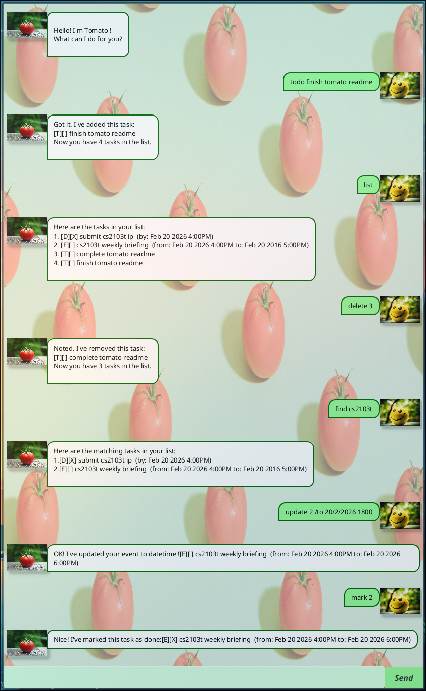

# Tomato User Guide

Product screenshot (product name/title bar of window is not visible in the current screenshot due to os desktop environment.)
 

Tomato is a task tracking chatbot gui app that helps people manage their tasks. It is optimized for cli usage with a gui display.
## Quick start
1. Ensure java `17` is installed.
2. Download the latest `.jar` file from [here](https://github.com/ZealousGinger/ip/releases).
3. Copy the file to an empty folder.
4. Open a terminal, go to the folder, and run `java -jar tomato.jar` to run the app. 
1. `todo work on Tomato readme`: Add a todo task.
2. `deadline submit cs2103t ip /by 20/2/2026 1600`: Add a deadline task.
3. `event cs2103t weekly briefing /from 20/2/2026 1600 /to 20/2/2026 1700`: Add an event task.
4. `mark 1`: Marks task as done.
5. `find cs2103t`: Finds tasks that matches tasks description with given keyword.
6. `delete 2`: Deletes tasks.
7. `list`: Lists all tasks.
7. `bye`: Exits the app.
8. `java -jar tomato.jar`: relaunch the app
9. `list`
10. `update 2 /to 20/2/2026 1800`: Updates the tasks end datetime.
11. `unmark 1`: Unmarks task as not done.
12. `list`

## Features
### Adding a todo task: `todo`
Adds a todo task to Tomato.

Format: `todo {TASK_DESCRIPTION}`

Examples:
- `todo cs2103t week 6 quiz`
- `todo work on ip readme`

Expected output:

```
Got it. I've added this task:
[T][ ] work on ip readme
Now you have 4 tasks in the list.
```

### Adding a deadline task: `deadline`
Adds a deadline task to Tomato.

Format: `deadline {TASK_DESCRIPTION} /by {DEADLINE_DATETIME}`

Examples:
- `deadline submit cs2103t ip /by 20/2/2026 1600`
- `deadline complete cs2103t week 6 quiz /by 20/2/2026 1600`

Expected output:

```
Got it. I've added this task:
[D][ ] complete cs2103t week 6 quiz (by: Feb 20 2026 4:00PM)
Now you have 5 tasks in the list.
```

### Adding an event task: `event`
Adds an event task to Tomato.

Format: `event {TASK_DESCRIPTION} /from {START_DATETIME} /to {END_DATETIME}`

Examples:
- `event cs2103t weekly briefing /from 20/2/2026 1600 /to 20/2/2026 1700`
- `event cs2103t week 5 tutorial /from 11/2/2026 0800 /to 11/2/2026 1000`

Expected output:

```
Got it. I've added this task:
[E][ ] cs2103t weekly briefing (from: Feb 20 2026 4:00PM to: Feb 20 2026 5:00PM)
Now you have 6 tasks in the list.
```

### Updating an existing task: `update`
Updates an existing task in Tomato.

Format:
- `update {TASK_NUMBER} /description {NEW_DESCRIPTION}`
- `update {TASK_NUMBER} /by {NEW_DEADLINE_DATETIME}`
- `update {TASK_NUMBER} /from {NEW_START_DATETIME}`
- `update {TASK_NUMBER} /to {NEW_END_DATETIME}`
- `update {TASK_NUMBER} /time {NEW_START_DATETIME} /to {NEW_END_DATETIME}`

Examples:
- `update 2 /description submit cs2103t ip v1`
- `update 2 /by 20/2/2026 1800`
- `update 3 /from 21/2/2026 0900`
- `update 3 /to 21/2/2026 1100`
- `update 3 /time 21/2/2026 0900 /to 21/2/2026 1100`

Expected output:

```
OK! I've updated your deadline due datetime ![D][ ] submit cs2103t ip (by: Feb 20 2026 6:00PM)
```

### Marking a task as done: `mark`
Marks a task as done.

Format: `mark {TASK_NUMBER}`

Examples:
- `mark 1`
- `mark 3`

Expected output:

```
Nice! I've marked this task as done:[T][X] work on ip readme
```

### Unmarking a task: `unmark`
Marks a task as not done.

Format: `unmark {TASK_NUMBER}`

Examples:
- `unmark 1`
- `unmark 3`

Expected output:

```
OK! I've marked this task as not done yet:[T][ ] work on ip readme
```

### Deleting a task: `delete`
Deletes a task from Tomato.

Format: `delete {TASK_NUMBER}`

Examples:
- `delete 2`
- `delete 4`

Expected output:

```
Noted. I've removed this task:
[D][ ] submit cs2103t ip (by: Feb 20 2026 4:00PM)
Now you have 3 tasks in the list.
```

### Finding tasks by keyword: `find`
Finds tasks containing the given keyword.

Format: `find {KEYWORD}`

Examples:
- `find cs2103t`
- `find meeting`

Expected output:

```
Here are the matching tasks in your list:
1.[T][ ] cs2103t week 6 quiz
2.[E][ ] cs2103t weekly briefing (from: Feb 20 2026 4:00PM to: Feb 20 2026 5:00PM)
```

### Listing all tasks: `list`
Lists all tasks currently in Tomato.

Format: `list`

Expected output:

```
Here are the tasks in your list:
1. [T][ ] work on ip readme
2. [D][ ] submit cs2103t ip (by: Feb 20 2026 4:00PM)
3. [E][ ] cs2103t weekly briefing (from: Feb 20 2026 4:00PM to: Feb 20 2026 5:00PM)
```

### Exiting the app: `bye`
Exits Tomato.

Format: `bye`

Expected output:

```
Bye. Hope to see you again soon!
```

## Notes
- Date-time format accepted by commands is `d/M/yyyy HHmm` (e.g. `20/2/2026 1600`).


## Command summary

| Command | Format | Example |
|---|---|---|
| `todo` | `todo {TASK_DESCRIPTION}` | `todo cs2103t week 6 quiz` |
| `deadline` | `deadline {TASK_DESCRIPTION} /by {DEADLINE_DATETIME}` | `deadline submit cs2103t ip /by 20/2/2026 1600` |
| `event` | `event {TASK_DESCRIPTION} /from {START_DATETIME} /to {END_DATETIME}` | `event cs2103t weekly briefing /from 20/2/2026 1600 /to 20/2/2026 1700` |
| `update` | `update {TASK_NUMBER} /description {NEW_DESCRIPTION}` | `update 1 /description cs2103t week 7 quiz` |
| `update` | `update {TASK_NUMBER} /by {NEW_DEADLINE_DATETIME}` | `update 2 /by 20/2/2026 1800` |
| `update` | `update {TASK_NUMBER} /from {NEW_START_DATETIME}` | `update 3 /from 20/2/2026 1800` |
| `update` | `update {TASK_NUMBER} /to {NEW_END_DATETIME}` | `update 3 /to 20/2/2026 2000` |
| `update` | `update {TASK_NUMBER} /time {NEW_START_DATETIME} /to {NEW_END_DATETIME}` | `update 3 /time 20/2/2026 1800 /to 20/2/2026 2000` |
| `mark` | `mark {TASK_NUMBER}` | `mark 1` |
| `unmark` | `unmark {TASK_NUMBER}` | `unmark 2` |
| `delete` | `delete {TASK_NUMBER}` | `delete 1` |
| `find` | `find {KEYWORD}` | `find cs2103t` |
| `list` | `list` | `list` |
| `bye` | `bye` | `bye` |
